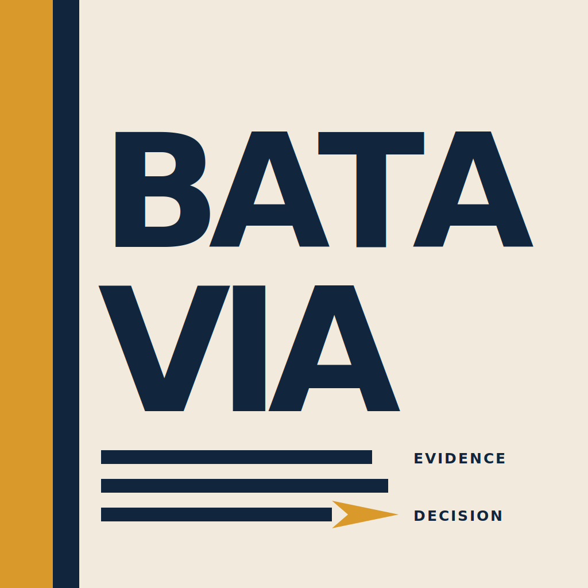
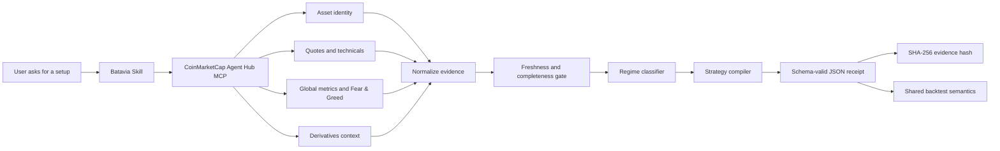

# Batavia

<p align="center">
  
</p>

<p align="center">
  <strong>CoinMarketCap evidence in. Auditable strategy receipt out.</strong>
</p>

<p align="center">
  <a href="SKILL.md"></a>
  <a href="schema/regime_strategy.schema.json"></a>
  <a href="LICENSE"></a>
  
</p>

Batavia is an evidence compiler for crypto trading agents. It turns
CoinMarketCap market data into a deterministic, schema-validated strategy
receipt that another agent, analyst, or execution system can inspect before
risk is taken.

It does not connect a wallet, sign transactions, or pretend to be a live bot.
Its job is to answer a narrower and safer question:

> Does the current CMC evidence authorize a strategy, reject risk, or require
> abstention because the data is stale or incomplete?

## Elevator Pitch

Trading agents are getting faster, but their reasoning is still too hard to
audit. Batavia gives them a missing control layer: before an agent can act, it
must compile CMC evidence into a small receipt that says what the market data
permits, what invalidates the idea, and when the honest answer is no trade.

Instead of another confident market opinion, Batavia produces a replayable
contract: CMC tools in, normalized signals through a deterministic regime
router, schema-valid strategy out. It is built for researchers today and for
future autonomous execution systems that need a clean boundary between
evidence, decision, and action.

## At A Glance

| Area | Batavia answer |
|---|---|
| Competition track | BNB Hack Track 2, Strategy Skills |
| Primary surface | CoinMarketCap Agent Hub Skill |
| Special-prize target | Best Use of Agent Hub |
| Output | JSON strategy receipt |
| Decisions | `ACTIVE`, `STAND_ASIDE`, `INSUFFICIENT_DATA` |
| Execution | None; research boundary only |
| Safety | No wallet, no private keys, no order signing |

For a compact evaluator summary, see
[`docs/AI_REVIEW_BRIEF.md`](docs/AI_REVIEW_BRIEF.md).

## Product Promo

Watch the Batavia product promo on YouTube:
[`youtube.com/watch?v=oYWzDfsZISM`](https://www.youtube.com/watch?v=oYWzDfsZISM).

The rendered video and HyperFrames source live in
[`outputs/batavia-product-promo`](outputs/batavia-product-promo/).

## Why It Exists

Most agent-trading demos jump from market data to action too quickly. Batavia
adds a research boundary in the middle. Before any execution layer can act, the
receipt records:

- which CMC asset was resolved;
- which CMC tools produced the evidence;
- when each source was observed;
- whether the evidence is fresh enough;
- which regime is supported;
- what strategy is allowed;
- what would invalidate the decision;
- which alternatives were rejected.

The same evidence produces the same receipt hash, so the decision can be
replayed, audited, and backtested.

## Who It Serves

Batavia is useful anywhere a trading workflow needs a verifiable decision
boundary:

| User | Why Batavia helps |
|---|---|
| Research agents | Converts messy market context into a strict strategy contract |
| Human analysts | Shows exactly which evidence supported or rejected a setup |
| Execution agents | Receives an auditable instruction instead of free-form prose |
| Risk reviewers | Can inspect freshness, invalidation, sizing, and rejected alternatives |
| Hackathon judges | Can replay the demo and validate the schema without API secrets |

## Architecture



## Decision Model

Batavia classifies each evidence snapshot with deterministic priority rules:

1. Fear & Greed at or below 20 means immediate `RISK_OFF`.
2. Fear & Greed at or above 80 plus crowded funding means `EUPHORIA`.
3. Trend score at or above 0.5 for three hourly bars means `TRENDING_UP`.
4. Trend score at or below -0.5 for three hourly bars means `RISK_OFF`.
5. Everything else is `RANGING`.

Only confirmed `TRENDING_UP` can become `ACTIVE`. Every other complete regime
stands aside. Missing or stale required evidence becomes `INSUFFICIENT_DATA`.

## Agent Hub Special-Prize Case

Batavia's strongest special-prize lane is **Best Use of Agent Hub**.

The CMC integration is part of the machine-readable contract, not only the
README narrative:

- `SKILL.md` defines an MCP-first workflow using CMC identity, quotes,
  technicals, global metrics, Fear & Greed, derivatives, and historical OHLCV.
- Each receipt includes an `agent_hub` block naming the Skill, MCP, and CLI
  replay surfaces.
- The receipt records source tool names and timestamps before the strategy is
  authorized.
- The evidence hash covers the Agent Hub contract, CMC ID, normalized signals,
  source tool names, timestamps, and confirmation count.
- Offline replay exists for judging and reproducibility; it does not substitute
  third-party data for CMC evidence.

## Beyond The Hackathon

Batavia is designed to survive past a judging window. The same receipt pattern
can become a reusable control surface for agentic trading systems:

- a research agent can emit a receipt instead of a paragraph;
- a risk system can reject stale or incomplete evidence before execution;
- a wallet or execution agent can require a valid receipt before signing;
- an analyst can compare rejected alternatives instead of reading opaque model
  reasoning;
- a data provider can make provenance and freshness part of the product
  contract.

The long-term idea is simple: autonomous trading should not begin with a trade.
It should begin with a small, verifiable statement of what the evidence permits.

## Receipt Shape

Example receipts:

- [`examples/bnb_active.json`](examples/bnb_active.json)
- [`examples/btc_risk_off.json`](examples/btc_risk_off.json)

Each receipt contains:

| Section | Purpose |
|---|---|
| `asset` | Symbol and numeric CMC ID |
| `agent_hub` | Skill, MCP, CLI replay, required CMC tools, x402 policy |
| `evidence` | Source names, timestamps, freshness, missing inputs, hash |
| `regime` | Label, confirmation count, normalized scores, rationale |
| `active_strategy` | Entry, exit, sizing, fees, and invalidation rules |
| `validation` | Shared backtest assumptions and candidate selection gate |
| `alternatives_rejected` | Strategies intentionally not authorized |

## Quick Demo

The offline demo needs no API key:

```bash
pip install -r requirements.txt
python demo.py
python demo.py --json
python verify.py
```

Expected demo outcomes:

| Case | Result |
|---|---|
| Fresh confirmed uptrend | `ACTIVE` momentum receipt |
| Fresh extreme fear | `STAND_ASIDE` cash receipt |
| Stale evidence | `INSUFFICIENT_DATA` cash receipt |

Every demo receipt is checked against
[`schema/regime_strategy.schema.json`](schema/regime_strategy.schema.json).

## Generate A Receipt

```bash
python generate_spec.py BNB \
  --cmc-id 1839 --trend 0.72 --vol normal \
  --fear-greed 62 --funding 0.18 --confirmation 3 \
  --as-of 2026-06-20T10:00:00Z \
  --observed-at 2026-06-20T09:30:00Z \
  --source get_crypto_technical_analysis \
  --source get_global_metrics_latest \
  --source get_global_crypto_derivatives_metrics
```

## Backtesting

The receipt rules and backtest engine share the same execution assumptions:

- closed-bar signals;
- next-bar-open execution;
- stop-first intrabar fills;
- fees on entry and exit;
- mark-to-market equity;
- bounded ATR position sizing;
- final-bar liquidation.

Portable checks:

```bash
python verify.py
```

Historical CMC validation, if the submitting key has OHLCV access:

```bash
export CMC_API_KEY=...
python backtest/fetch_cmc.py --days 365
python backtest/validate_basket.py --out results/validation.json
python backtest/render_results.py
python backtest/check_reproduction.py
```

Batavia does not claim final multi-asset historical performance unless that
validation file can be generated from CoinMarketCap historical data. No
third-party substitute. No old cache. No fake certainty.

## Review Path

For judges and reviewers:

1. Read [`SKILL.md`](SKILL.md) for the Agent Hub workflow.
2. Read [`docs/AI_REVIEW_BRIEF.md`](docs/AI_REVIEW_BRIEF.md) for the compact score map.
3. Run `python demo.py`.
4. Inspect [`examples/bnb_active.json`](examples/bnb_active.json).
5. Run `python verify.py`.
6. Read [`docs/JUDGING_BRIEF.md`](docs/JUDGING_BRIEF.md).

## Project Map

| Path | What it is |
|---|---|
| [`SKILL.md`](SKILL.md) | CMC Strategy Skill workflow |
| [`batavia/regime.py`](batavia/regime.py) | Regime classifier and receipt compiler |
| [`schema/regime_strategy.schema.json`](schema/regime_strategy.schema.json) | Strict receipt schema |
| [`generate_spec.py`](generate_spec.py) | CLI receipt generator |
| [`demo.py`](demo.py) | Offline three-case demo |
| [`verify.py`](verify.py) | Portable acceptance suite |
| [`backtest/engine.py`](backtest/engine.py) | No-look-ahead backtest engine |
| [`backtest/validate_basket.py`](backtest/validate_basket.py) | Seven-policy validation gate |
| [`docs/DEMO.md`](docs/DEMO.md) | Suggested recording flow |
| [`docs/AI_REVIEW_BRIEF.md`](docs/AI_REVIEW_BRIEF.md) | Compact AI/human evaluator guide |
| [`docs/JUDGING_BRIEF.md`](docs/JUDGING_BRIEF.md) | Judge-facing guide |
| [`docs/METHODOLOGY.md`](docs/METHODOLOGY.md) | Backtest methodology |
| [`docs/SUBMISSION_PROFILE.md`](docs/SUBMISSION_PROFILE.md) | DoraHacks copy |

## Safety Posture

Batavia is long-only research software. It has no wallet, no order signing, no
token launch, and no execution layer.

- No private keys, seed phrases, wallets, or signing authority are handled.
- No transaction is created, signed, broadcast, or simulated as execution proof.
- No token launch, liquidity opening, fundraising, or airdrop flow exists.
- Outputs are research receipts, not financial advice or trade confirmations.
- API keys are read from environment variables only and are not committed.

The `EUPHORIA` branch is covered by deterministic synthetic tests because
historical funding data is not assumed to be available. Past performance does
not guarantee future results.

## License

MIT
