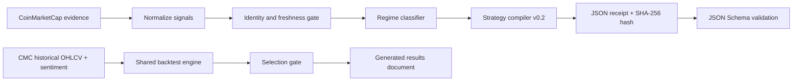

# Project Status

**Last verified:** 2026-06-20  
**Current version:** `0.2.0`  
**Competition track:** BNB Hack Track 2, Strategy Skills  
**State:** implementation verified; final CMC historical validation depends on API entitlement

## What Batavia is now

Batavia is a deterministic CoinMarketCap evidence compiler. It does not execute
trades. It accepts normalized market evidence, checks identity and freshness,
classifies the market regime, and emits a schema-validated strategy receipt.

The receipt answers five operational questions:

1. Is the evidence complete and fresh?
2. Which market regime is supported?
3. Is risk authorized, rejected, or impossible to assess?
4. What exact entry, exit, sizing, and invalidation rules apply?
5. Which evidence produced the decision?

The three possible decisions are `ACTIVE`, `STAND_ASIDE`, and
`INSUFFICIENT_DATA`. Only a confirmed `TRENDING_UP` regime can authorize the
long-only momentum strategy. The current public playbook holds cash in all
other regimes.

## System map



## Implementation progress

| Plan area | Status | Evidence |
|---|---|---|
| Preserve regimes, pure-Python indicators, Skill format, JSON spec, CLI, synthetic tests | Complete | `batavia/`, `SKILL.md`, `generate_spec.py`, `backtest/synthetic.py` |
| Independent CMC-ID-first client | Complete | `batavia/cmc.py`, bounded retry and UTC tests |
| Strategy contract `v0.2` | Complete | strict versioned schema and golden BNB receipt |
| Confirmation and stale-data handling | Complete | three-bar confirmation, immediate risk override, two-hour freshness gate |
| Correct shared backtester | Complete | next-open fills, high/low SL/TP, stop-first, MTM equity, two-sided fees, final liquidation |
| Seven candidate policies | Complete | router, trend/cash, sentiment veto, static momentum, static mean reversion, buy-and-hold, cash |
| Three chronological windows and selection gate | Complete | deterministic validation and explicit selection score |
| Fresh 365-day, seven-asset CMC dataset | Blocked | CMC identity and sentiment calls succeed; hourly historical OHLCV returns HTTP 403 for the supplied plan |
| Generated final performance results | Not claimed | intentionally not generated without the required CMC dataset |
| README, methodology, examples, submission copy | Complete | documentation and v0.2 examples rewritten |
| Reproduction checker | Complete | compares fresh engine output, committed JSON, and rendered results exactly |
| Clean-room separation | Complete | scan finds no references to the four unrelated bot projects |

## Candidate selection state

No strategy winner has been declared yet. This is deliberate.

The engine will evaluate seven policies on BTC, ETH, BNB, SOL, AVAX, LINK, and
DOGE over three non-overlapping chronological windows. A regime-aware candidate
must have:

- positive median window return; and
- positive compounded return on at least four of seven assets.

Eligible candidates are ranked by:

```text
median window return / median window max drawdown
```

If no router passes, the documented fallback is momentum with a sentiment risk
veto. If mean reversion fails its gate, it remains only a rejected research
baseline and is absent from the public playbook.

## Current external limit

On 2026-06-20, a fresh CMC API key successfully reached asset identity and
Fear & Greed endpoints. The request to
`/v2/cryptocurrency/ohlcv/historical` returned HTTP `403 Forbidden`.

This normally indicates that the key's subscription does not include hourly
historical OHLCV. The key itself is not stored anywhere in this repository.
Batavia will not silently use another provider, a sibling repository, or an old
cache because that would invalidate the published methodology.

## How to continue

With a CMC key entitled to historical OHLCV:

```bash
export CMC_API_KEY=...
python backtest/fetch_cmc.py --days 365
python backtest/validate_basket.py --out results/validation.json
python backtest/render_results.py
python backtest/check_reproduction.py
python -m unittest discover -v
```

Before publishing, confirm that `data/cmc/manifest.json` records seven assets,
the requested time range, at least 95% hourly coverage, and a SHA-256 checksum
for every CSV. The dataset is intentionally git-ignored; the manifest and final
validation report should be archived with the submission evidence as needed.

## Verified commands

These checks passed on 2026-06-20:

```text
python -m unittest discover -v       34 tests passed
python backtest/synthetic.py          5 scenarios passed
python -m compileall                  passed
schema validation of both examples   passed
git diff --check                     passed
clean-room text scan                  passed
```

`backtest/check_reproduction.py` cannot pass until the final CMC dataset and
`results/validation.json` exist.

## Repository guide

| Path | Responsibility |
|---|---|
| `batavia/indicators.py` | Pure-Python EMA, RSI, ATR, Bollinger, trend and volatility signals |
| `batavia/regime.py` | Regime rules, evidence quality, strategy receipt, evidence hash |
| `batavia/cmc.py` | Standalone CMC Pro API client |
| `schema/regime_strategy.schema.json` | Machine-enforced v0.2 output contract |
| `generate_spec.py` | CLI receipt generator |
| `backtest/engine.py` | Shared execution engine for all candidates |
| `backtest/fetch_cmc.py` | Fresh CMC research-data fetch and provenance manifest |
| `backtest/validate_basket.py` | Seven-asset comparison and strategy gate |
| `backtest/render_results.py` | Deterministic Markdown results renderer |
| `backtest/check_reproduction.py` | JSON and documentation reproduction check |
| `demo.py` | Three-decision, schema-validated offline product demo |
| `verify.py` | One-command portable acceptance suite |
| `tests/` | Indicators, regimes, CMC behavior, schema, golden output, execution semantics |

## Non-goals

- No wallet connection, order signing, or transaction execution.
- No leverage, short selling, LP management, or competition-specific trading quotas.
- No performance claim until the final CMC dataset passes provenance checks.
- No copied code, data, configuration, or narrative from unrelated bots.
